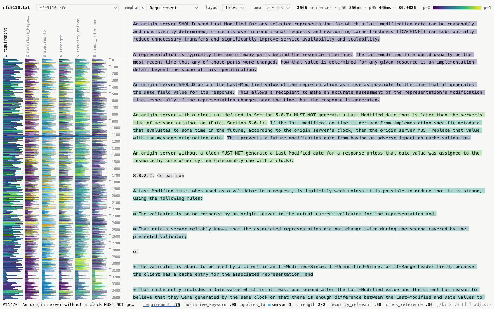
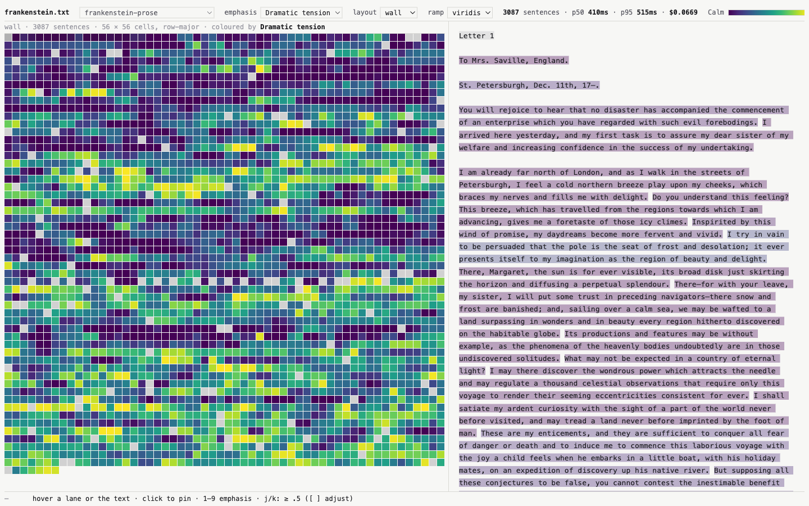
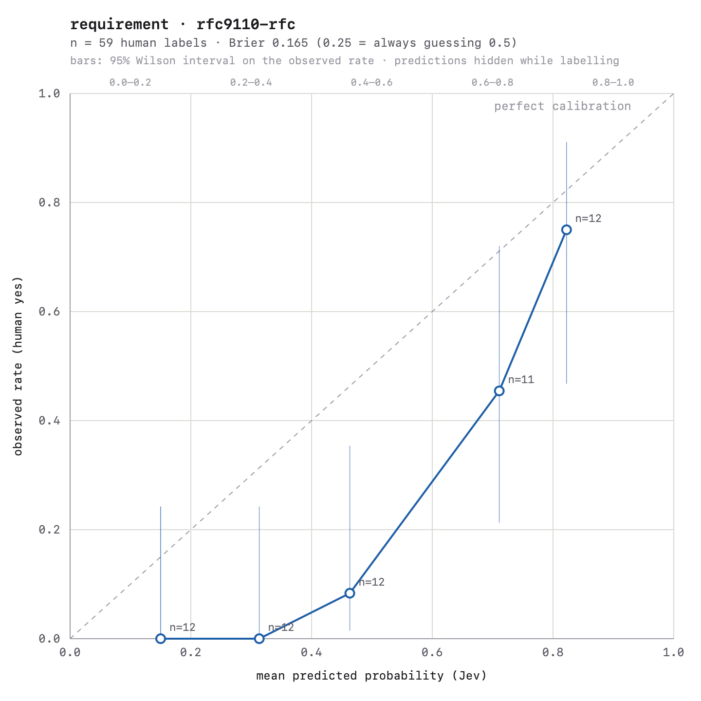

# Semantic Microscope

Label every sentence of a document with calibrated probabilities from Jev (TypeSafe AI's System
One model), then look at the whole document at once.

One HTTP request per sentence carries five or six typed questions. Jev evaluates them in parallel
against the same state and output tokens are free, so a 3,000-sentence document costs about
eight cents and takes about three and a half minutes from Bengaluru. The viewer turns the answers
into parallel lanes, one per question, with the full document always in view.



Left: six lanes, one row per sentence, the emphasised lane wider. Middle: a sentence ruler.
Right: the source text tinted by the emphasised dimension. Bottom: every value for the pinned
sentence. Keys 1 to 9 change emphasis, j/k jump to the next sentence above a threshold.

## Install

Python 3.11+, [uv](https://docs.astral.sh/uv/), and a TypeSafe API key.

```
git clone <this repo> && cd semantic-microscope
uv sync
cp .env.example .env            # put TYPESAFE_API_KEY=... in it
uv run microscope --help
```

No other dependencies: `httpx`, `pysbd`, `pyyaml`, `typer`, stdlib `sqlite3`. The viewer is
plain HTML, CSS and JS with no build step. Nothing here calls an LLM.

## Usage

```
uv run microscope prepare <url-or-file> [--out samples/x.txt] [--start-at TEXT] [--end-at TEXT]
uv run microscope label samples/x.txt --preset contract|prose|rfc [--limit N] [--run-id ID]
                                     [--resume | --force] [--dry-run] [--chaos]
uv run microscope serve [--layout lanes|wall] [--port 8000]
uv run microscope stats <run-id>
uv run microscope validate <run-id> --dimension <noul-dimension> [--add N] [--report-only]
uv run microscope calibration-chart <run-id>
```

**prepare** turns a web page or a raw text file into clean paragraphs. It strips HTML chrome and
footnotes, trims Project Gutenberg boilerplate and illustration captions, flattens ASCII tables,
unwraps hard-wrapped lines and keeps paragraph breaks, then prints what it dropped. Use
`--start-at` / `--end-at` to cut prefaces, contents lists and imprints by paragraph prefix.

**label** segments the text into sentences (pysbd, paragraph by paragraph, with a regex fallback
for long quoted passages), sends one request per sentence carrying all of the preset's
questions plus one sentence of context on each side, and writes `data/<run-id>.jsonl` one line
per sentence as answers arrive, then `data/<run-id>.meta.json`. Sentences under three words are
recorded with `error: "too_short"` and no request. Failures after four attempts are recorded
with `answers: {}` and an error string, never dropped. Answers are cached in SQLite keyed on the
sentence, its neighbours, the preset and the model, so a re-run with the same preset is served
from disk in a few seconds. `--resume` continues an interrupted run. `--limit` defaults to 500.

**serve** hosts the viewer at `http://127.0.0.1:8000/viewer/` and lists runs from `data/`.

**Layouts.** Lanes (above) show every dimension side by side. Wall wraps the document into a
near-square grid, one cell per sentence, row-major, coloured by the emphasised dimension, for a
poster-style view of a whole book:



Frankenstein, 3,087 sentences, 56 × 56 cells, coloured by the prose preset's dramatic-tension
score. Hovering a cell shows the sentence and every dimension in the status line; clicking
scrolls the reading pane to it.

**Presets** live in `presets/*.yaml`. Each dimension is one Jev question: a Noul (one
probability), a Score (ordered levels, returns a value plus a distribution) or a Choice (options,
returns the winner plus a distribution). `contract` asks about obligation, risk, ambiguity,
financial consequence, liability and clause type. `prose` asks about tension, plot load, dialogue,
sensory density and interiority. `rfc` asks about requirements, RFC 2119 keywords, which party a
rule binds, strength, security relevance and cross-references. Add a YAML file to add a preset;
up to nine dimensions so the number keys cover them.

## Measured from Bengaluru

All numbers from `microscope stats` on cold-cache runs against the US-West-only endpoint at
15 requests/s with 12 in flight. Nothing rounded away. p-values are per-request client round
trip; "live" is the number of sentences that made a request.

| date (UTC) | run | preset | sentences (live) | wall | p50 | p95 | p99 | max | 429s | errors | input tokens | cost |
| ---------- | --- | ------ | ---------------- | ---- | --- | --- | --- | --- | ---- | ------ | ------------ | ---- |
| 2026-09-19 | sample-contract (synthetic MSA) | contract | 484 (482) | 33.2s | 385ms | 506ms | 617ms | 936ms | 0 | 0 | 336,040 | $0.0141 |
| 2026-09-19 | gdpr-contract (GDPR, EUR-Lex HTML) | contract | 1,977 (1,630) | 108.9s | 357ms | 454ms | 578ms | 1,325ms | 0 | 0 | 1,144,375 | $0.0481 |
| 2026-09-19 | pride-and-prejudice-prose (Gutenberg #1342) | prose | 4,796 (4,658) | 310.9s | 356ms | 452ms | 555ms | 1,496ms | 0 | 0 | 2,540,710 | $0.1067 |
| 2026-09-20 | rfc9110-rfc (RFC 9110 HTTP Semantics) | rfc | 3,566 (3,001) | 200.6s | 356ms | 446ms | 570ms | 1,741ms | 0 | 0 | 1,965,887 | $0.0826 |
| 2026-09-20 | frankenstein-prose (Gutenberg #84) | prose | 3,087 (2,970) | 198.8s | 410ms | 515ms | 636ms | 1,201ms | 0 | 0 | 1,592,274 | $0.0669 |

Where the time goes, per request (RFC 9110 run):

| component | p50 | p95 | p99 |
| --------- | --- | --- | --- |
| server, from `x-envoy-upstream-service-time` | 98ms | 162ms | 209ms |
| network and TLS (client minus server) | 247ms | 322ms | 367ms |

Roughly two thirds of every request is the Pacific round trip, not inference. Every run above
sat at the 15 rps limiter for its whole duration, so wall time is sentences ÷ 15. Re-running
the GDPR with a warm cache took 2.9s for 1,977 sentences and made no requests. Cost is
`input_tokens × $0.042 / 1M` from the published price list, not a bill; output tokens are free.
Tokens per sentence sit between 530 and 700 because each request carries the question
definitions and one sentence of context on each side.

## Calibration

TypeSafe says Jev's probabilities are calibrated. That is a training-objective claim, and
TypeSafe publishes no reliability diagram, so this repo measures it on its own data and nothing
here presents the probabilities as truth.

`microscope validate <run-id> --dimension <noul>` draws a stratified sample, about six sentences
from each of five probability buckets so you see high, low and middling predictions rather than
30 boring ones, shows each sentence **with Jev's prediction hidden**, and asks y / n / skip.
Hiding the prediction is the whole point: if you can see the number first you are measuring
your own anchoring, not the model's calibration. Labels save after every answer to
`data/<run-id>.labels.json`; `q` stops, rerunning resumes, `--add 30` draws a fresh batch into
the same file, `--report-only` reprints the table. `calibration-chart` draws it.



Result so far: one dimension (`requirement`, "Ignoring this sentence would make an implementation
non-compliant"), one document (RFC 9110), one labeller, 59 labels.

```
bucket       n   predicted   observed
0.0–0.2     12        0.15       0.00
0.2–0.4     12        0.31       0.00
0.4–0.6     12        0.46       0.08
0.6–0.8     11        0.71       0.45
0.8–1.0     12        0.82       0.75

Brier score: 0.165   (lower is better; 0.25 = always guessing 0.5)
```

What we did verify: the ordering is right (higher predicted, higher observed, monotone across all
five buckets) and the Brier score beats guessing. What we did not: the probabilities are
over-confident on this dimension, sitting below the diagonal in every bucket. The 12-per-bucket
intervals are wide enough that the two ends are consistent with calibration and the middle is
not. One labeller reading "non-compliant" as MUST-only, while Jev spreads SHOULD sentences
across 0.2 to 0.7, explains part of the gap; that is a disagreement about the question as much
as about the model. A second sanity check is free: `normative_keyword` is a lexical question, and
against a regex Jev found all 413 keyword sentences (recall 1.00) and added 107 without one
(precision 0.79 at a 0.5 threshold). None of this generalises past one document and one
dimension. Label more, on other documents, before drawing a conclusion.

## Things to know

- **Jev only.** Three primitives, no text generation. It is bad at arithmetic, counting and date
  ordering, and it reads literally, so preset questions are plain positive judgments.
- **State is not treated as hostile.** Document text goes straight into the request. If you point
  this at untrusted input, prompt injection is your problem, not the model's.
- **Segmentation shapes everything.** pysbd runs per paragraph; anything over 600 characters is
  regex-split at sentence terminators. Headings, list markers and ABNF lines become grey rows or
  noise. `prepare` reports what it dropped; read that before trusting a run.
- **Model is pinned** to `jev-1.13.0`. Every response's `model` field is checked; drift is warned
  once and recorded in the meta file.
- **The observed API shape** in `docs/jev-api-observed.md` is ground truth for this repo.

## Layout

```
microscope/   cli, jev client, segment, presets, pipeline, cache, stats, validate, chart, prepare, viewer_server
viewer/       index.html, app.js (lanes, wall, ruler, status line), reading.js (reading pane, tooltips, sync, keys), style.css
presets/      contract.yaml, prose.yaml, rfc.yaml
samples/      sample-contract.txt (synthetic), gdpr.txt, pride-and-prejudice.txt, rfc9110.txt, frankenstein.txt
docs/         jev-api-observed.md, img/
data/         gitignored: runs, cache.sqlite, labels
```
